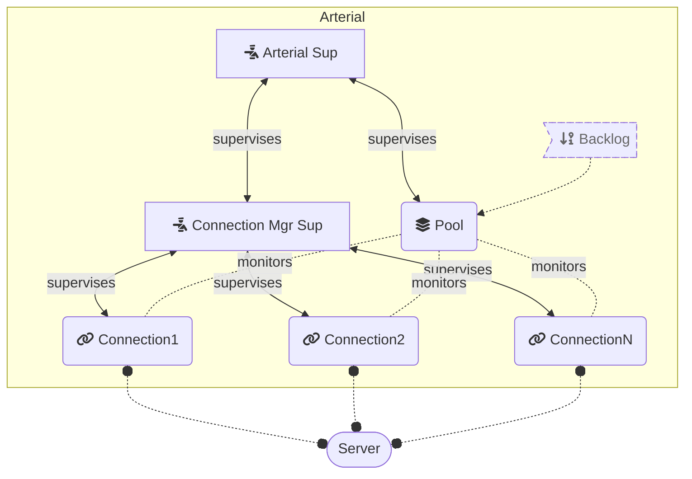

# Arterial

**TODO: Add description**

## Installation

If [available in Hex](https://hex.pm/docs/publish), the package can be installed
by adding `arterial` to your list of dependencies in `mix.exs`:

```elixir
def deps do
  [
    {:arterial, "~> 0.1.0"}
  ]
end
```

## Architecture



Documentation can be generated with [ExDoc](https://github.com/elixir-lang/ex_doc)
and published on [HexDocs](https://hexdocs.pm). Once published, the docs can
be found at <https://hexdocs.pm/arterial>.

