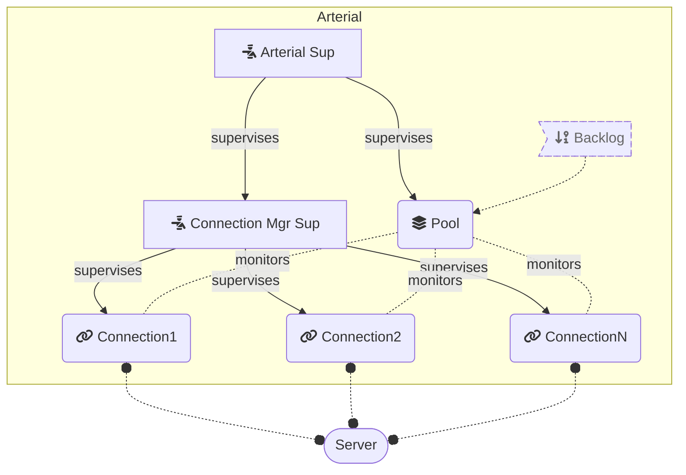

# Arterial

**TODO: Add description**

## Installation

If [available in Hex](https://hex.pm/docs/publish), the package can be installed
by adding `arterial` to your list of dependencies in `mix.exs`:

```elixir
def deps do
  [
    {:arterial, "~> 0.1.0"}
  ]
end
```

## Architecture



## Protocol

It is the responsibility of the user to provide a module for encoding and decoding messages over the selected socket transport. Below are the types of common use cases for the protocol:

1. Each wire-level message contrains a 32bit (or 64bit) request ID. In this case the requests can be sent asynchronously and replies are not required to arrive in the FIFO order.  A backlog setting is required to be set to the value below 65,536.  No more than 64k asynchronous in-flight requests are supported.

2. Wire-level messages don't encode a request ID. In this case the replies are expected to come in the FIFO order of sent requests, and there are two possibilities of use:

    1. If a client needs to send requests asynchronously, then it's required to allocate a backlog below 65k.

    2. A client reserves the connection for the lifetime of a request, and awaits for the response from the server synchronously. In this case no backlog is needed, and the default backlog setting of 1 is used. 

## Documentation

The docs can be found at <https://hexdocs.pm/arterial>.

