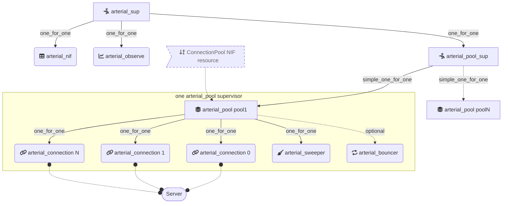

[](https://github.com/saleyn/arterial/actions/workflows/erlang.yaml)
[](https://hex.pm/packages/arterial)
[](https://hex.pm/packages/glazer)

`arterial` is a high-performance Erlang/Elixir connection-pooling library for
clients that talk to a server (or cluster of servers) over SSL/TCP/UDP.
The design is structurally a shared-nothing/lock-free concurrent model.
The pool, per-connection backlog tracking, and rate throttling are implemented
in a C++ NIF for performance; connection lifecycle, supervision, and socket
I/O stay on the Erlang side.

It's protocol-agnostic: you supply a module that knows how to encode
requests and decode responses for your wire protocol, and Arterial handles
checking out a connection, tracking in-flight requests, throttling,
reconnecting on failure, and timing out asynchronous requests that never
get a reply.

**Supported features:**

* Lock-free, atomic CAS–based connection pool (C++ NIF) with FIFO checkout
  order and ABA-safe versioned node indices.
* Per-connection request backlog, in either FIFO order (no wire-level
  request ID required) or random-access order (wire-level request ID,
  out-of-order replies supported), up to 65,536 in-flight requests per
  connection.
* Per-connection rate throttling (token-bucket style) checked on every
  checkout.
* A synchronous request API (`arterial_client:call/3`) where the caller
  owns the socket for the duration of one request/reply, and a
  send-and-forget API (`arterial_client:cast/2`) for protocols with no
  reply at all -- returns as soon as the request is handed to the
  transport, without ever holding a backlog slot in flight.
* An in-flight request registry (`UnorderedTTLMap`, owned by each
  pool's `ConnectionPool` instance) for the asynchronous path: register a
  request with `arterial_nif:track_inflight/5`, and if no matching
  `checkin_connection/4` happens before its TTL expires, the owning process
  receives `{arterial_timeout, Pool, ReqID}` and the request's backlog slot
  (and the connection itself) is automatically released back to the pool.
  TTLs can be either a single fixed duration per pool or set individually
  per request.
* An optional, lock-free, bounded queue-when-busy wait-list
  (`arterial_nif:checkout_async/3`): when every connection is busy, a
  caller can be queued (up to a fixed capacity set at pool creation)
  instead of failing immediately, and is serviced automatically as soon as
  a connection frees up, or timed out if it waits too long. Disabled by
  default (zero behavioral/cost impact unless explicitly enabled); see
  [Queue-when-busy checkouts](#queue-when-busy-checkouts).
* A per-pool `arterial_sweeper` process that periodically evicts expired
  in-flight requests and expired queued waiters by calling
  `arterial_nif:sweep_timeouts/1`.
* Automatic reconnect with exponential backoff per connection
  (`arterial_connection`).
* **Smart DNS resolution with Kubernetes awareness**: Enhanced hostname
  resolution that automatically detects and handles Kubernetes service names,
  supports search domain expansion (`redis` → `redis.namespace.svc.cluster.local`),
  environment-aware caching (60s TTL for K8s services, 300s for external), and
  maintains full backwards compatibility. See [DNS Resolution](#dns-resolution)
  and [Kubernetes](docs/kubernetes-dns.md) for details.
* Disconnect notification for the asynchronous path: when a connection's
  socket dies, every process with a still-outstanding (`track_inflight/5`-
  registered) request on it receives `{arterial_disconnected, Pool, ReqID}`
  -- one message per request -- before the backlog slot is released, so it
  can resubmit or persist that request outside `arterial` instead of
  silently losing it. See `arterial_nif:connection_down/2`.
* An optional, per-pool `arterial_bouncer` that recycles connections one
  at a time on a fixed rotation (`bounce_interval_ms`) -- e.g. to pick up
  DNS/load-balancer changes for long-lived connections -- waiting for
  each connection's backlog to drain (up to `bounce_drain_timeout_ms`)
  before disconnecting and reconnecting it. Disabled by default.
* **Six supported request/reply matching modes** covering all common
  wire protocol patterns: native/surrogate request IDs with random-access
  backlogs, FIFO-ordered matching (single or multi-request), send-and-forget,
  and acknowledgement-based protocols. See [Operating Modes](#operating-modes)
  and [Protocol](#protocol) for detailed descriptions.
* Pluggable observability: `call`/`cast`/`checkout`/`connect` spans plus
  `disconnect`/`sweep` events through a generic facade
  (`arterial_observe`), with built-in `telemetry` and `prometheus`
  backends (both strictly optional dependencies) or a custom backend
  module -- see [Observability](#observability).

## Installation

Add `arterial` as a [hex.pm](https://hex.pm/packages/arterial) package dependency:

**Erlang:** in your project's `rebar.config`
```erlang
{deps, [
  {:arterial, "~> 0.1"}
]}.
```

**Elixir:** in your project's `mix.exs`
```elixir
def deps do
  [
    {:arterial, "~> 0.1"}
  ]
end
```

## Operating Modes

Arterial supports six distinct request/reply matching modes to accommodate different wire protocol patterns. Choose the mode that best fits your protocol's message structure and reply ordering guarantees:

### 1. Native Request ID (Random Access) ✅ **IMPLEMENTED**
**Best for:** Protocols with built-in request/correlation IDs (32-bit or 64-bit)

Wire messages contain a native request ID field. Replies can arrive out-of-order and are matched by ID. Supports up to 64k concurrent requests per connection.

- **Configuration:** `fifo => false`, `backlog` up to 65,536
- **Use case:** HTTP/2, gRPC, custom protocols with correlation IDs
- **Performance:** Highest throughput with full async multiplexing
- **Implementation:** `arterial_client:call/3` + `arterial_codec` behavior

### 2. Surrogate Request ID (Random Access) ✅ **IMPLEMENTED**
**Best for:** Protocols without native request IDs but with repurposable fields

Similar to mode 1, but your `encode_request/3` injects a synthetic ID into an extensible field (header, tag, cookie) that the server echoes back. Same random-access matching and performance characteristics.

- **Configuration:** `fifo => false`, `backlog` up to 65,536
- **Use case:** Protocols with opaque fields, custom headers, or client cookies
- **Performance:** Same as mode 1 - full async multiplexing
- **Implementation:** `arterial_client:call/3` + custom `encode_request/3`

### 3. FIFO Single Request (Synchronous) ❌ **NOT IMPLEMENTED**
**Best for:** Simple protocols without request IDs, one request at a time

No request ID available. Client reserves connection for one request, sends synchronously, awaits reply in FIFO order. Connection is owned for the entire request duration.

- **Configuration:** `fifo => true`, `backlog => 1`
- **Use case:** Simple TCP protocols, legacy systems, debugging
- **Performance:** Lower throughput due to connection monopolization
- **Status:** Requires FIFO backlog implementation in NIF layer

### 4. FIFO Multi-Request (Pipelined) ❌ **NOT IMPLEMENTED**
**Best for:** Protocols without IDs but with guaranteed FIFO reply ordering

Multiple requests can be outstanding on one connection, matched purely by send order. **Requires server guarantee** of FIFO reply ordering - violations silently corrupt the backlog.

- **Configuration:** `fifo => true`, `backlog > 1`
- **Use case:** Redis pipeline, protocols with strict ordering guarantees
- **Performance:** Good throughput but depends on server FIFO compliance
- **Status:** Requires FIFO backlog implementation + connection reservation
- **⚠️ Warning:** Single out-of-order reply breaks all subsequent matches

### 5. Send-and-Forget (No Reply) ✅ **IMPLEMENTED**
**Best for:** Fire-and-forget operations like logging, metrics, notifications

Uses `arterial_client:cast/2` instead of `call/3`. Returns immediately after transport accepts the bytes - no backlog slot allocated, no reply expected.

- **Configuration:** Backlog/FIFO settings irrelevant
- **Use case:** Logging, metrics, notifications, pub/sub publishing
- **Performance:** Highest throughput - no reply processing overhead
- **Implementation:** `arterial_client:cast/2`

### 6. Acknowledgement-Based Protocols ⚠️ **PARTIALLY IMPLEMENTED**
**Best for:** Protocols using acknowledgements instead of data replies

Two variants with different implementation status:

**Per-message ACK** ✅ **IMPLEMENTED:** Server replies with simple acknowledgement (with or without ID). Uses same matching as modes 1/2 - your `decode_reply/2` returns `ack` or similar term.

**Bulk/Cumulative ACK** ❌ **NOT IMPLEMENTED:** Single acknowledgement confirms multiple previous requests (e.g., "processed through sequence N"). Would use `arterial_nif:checkin_up_to/3` to release multiple FIFO slots at once.

- **Configuration:** Per-message: `fifo => false`; Bulk: `fifo => true`
- **Use case:** Message queues, streaming protocols, batch processing
- **Performance:** Reduced reply traffic, efficient for high-volume streams
- **Status:** Per-message ACK works via modes 1/2; bulk ACK needs FIFO implementation

### Implementation Status Summary

**✅ Currently Available (3/6 modes):**
- **Mode 1:** Native Request ID - Full async multiplexing
- **Mode 2:** Surrogate Request ID - Full async multiplexing
- **Mode 5:** Send-and-Forget - No reply needed

**❌ Requires Implementation (2.5/6 modes):**
- **Mode 3:** FIFO Single Request - Needs FIFO backlog + connection reservation
- **Mode 4:** FIFO Multi-Request - Needs FIFO backlog + pipelining support
- **Mode 6 (partial):** Bulk/Cumulative ACK - Needs `checkin_up_to/3` + FIFO support

### Current Architecture Limitation

The existing `arterial_pool` backend (NIF-based) explicitly supports only **random-access protocols with correlation IDs** (modes 1/2/5). To implement the missing FIFO modes (3/4/6-bulk), arterial would need:

1. **FIFO backlog data structures** in the C++ NIF layer
2. **Connection reservation mechanisms** for single-request ownership
3. **Order-preserved request/reply matching** for pipelined protocols
4. **Batch checkin operations** for cumulative acknowledgements

### Choosing the Right Mode (Available Now)

- **Have native request IDs?** → ✅ Use Mode 1
- **Can inject synthetic IDs?** → ✅ Use Mode 2
- **No replies needed?** → ✅ Use Mode 5
- **Simple ACKs with IDs?** → ✅ Use Mode 6 (per-message variant)
- **No IDs, simple protocol?** → ❌ Mode 3 (planned)
- **No IDs, need pipelining?** → ❌ Mode 4 (planned)
- **Bulk acknowledgements?** → ❌ Mode 6-bulk (planned)

For complete implementation details, configuration examples, and advanced features, see the [Protocol](#protocol) section.

## Architecture


```mermaid
flowchart TD
    AS[fa:fa-person-military-pointing arterial_sup] -->|one_for_one| NIF(fa:fa-table arterial_nif)
    AS -->|one_for_one| OBS(fa:fa-chart-line arterial_observe)
    AS -->|one_for_one| PS[fa:fa-person-military-pointing arterial_pool_sup]

    PS -->|simple_one_for_one| P1[fa:fa-layer-group arterial_pool pool1]
    PS -.->|simple_one_for_one| PN[fa:fa-layer-group arterial_pool poolN]

    subgraph pool [one arterial_pool supervisor]
    P1 -->|one_for_one| C1(fa:fa-link arterial_connection 0)
    P1 -->|one_for_one| C2(fa:fa-link arterial_connection 1)
    P1 -->|one_for_one| CN(fa:fa-link arterial_connection N)
    P1 -->|one_for_one| SW(fa:fa-broom arterial_sweeper)
    P1 -.->|optional| BN(fa:fa-repeat arterial_bouncer)
    end

    B>fa:fa-arrow-down-9-1 ConnectionPool NIF resource] -.-> P1
    style B stroke-width:1px,color:#666,stroke-dasharray: 5 5

    C1 o-.-o S([Server])
    C2 o-.-o S
    CN o-.-o S
```

`arterial_sup` is the application's static `one_for_one` top supervisor,
with three permanent children: `arterial_nif` (the singleton owner of
every pool's per-connection buffer ETS table), `arterial_observe` (owns
the configured observability backend's lifecycle — see
[Observability](#observability) — a no-op if none is configured), and
`arterial_pool_sup`, a `simple_one_for_one` supervisor that spawns one
`arterial_pool` supervisor per named pool started via
`arterial_pool:start_link/2`.

Each `arterial_pool` supervisor creates the pool's C++-backed
`ConnectionPool` NIF resource (which tracks which connections are
checked out/available, their per-connection request backlog, throttles,
and in-flight async request registry — drawn as the dashed box above,
since it's NIF-resident state the supervisor owns a reference to, not a
supervised child), then starts one `arterial_connection` worker per
connection slot, one `arterial_sweeper` that periodically evicts
timed-out in-flight requests, and — only if the pool's
`bounce_interval_ms` option is set — one `arterial_bouncer` that
recycles connections on a rotation (see `arterial_bouncer`'s moduledoc
for why and how).

### Erlang layer

| Module | Responsibility |
|---|---|
| `arterial_app` | The `arterial` OTP application; defines `arterial_sup`, the top-level `one_for_one` supervisor (`arterial_nif` + `arterial_observe` + `arterial_pool_sup`). |
| `arterial_pool` | Per-pool `supervisor`; creates the NIF pool resource, then starts one `arterial_connection` worker per connection slot, one `arterial_sweeper`, and (if configured) one `arterial_bouncer`. |
| `arterial_connection` | One `gen_server` per pooled connection. Owns the socket, runs the connect/reconnect state machine with exponential backoff, and drives the user-supplied client callback module (`arterial_client`). |
| `arterial_sweeper` | Per-pool timer process; calls `arterial_nif:sweep_timeouts/1` on an interval to evict expired in-flight async requests. |
| `arterial_bouncer` | Optional per-pool timer process; recycles connections one at a time on a rotation via `arterial_connection:bounce/2`, only started when `bounce_interval_ms` is configured. |
| `arterial_observe` | Generic, pluggable observability facade (`span/3`/`event/2,3`); dispatches to a configurable backend module — see [Observability](#observability). |
| `arterial_observe_telemetry` / `arterial_observe_prometheus` | Built-in `arterial_observe` backends, forwarding to `telemetry` or recording directly into Prometheus metrics, respectively. |
| `arterial_socket` | Thin wrapper over Erlang's `socket` module for `tcp`/`udp` connect, plus `ssl` (requires OTP 28+ — see [SSL/TLS guide](docs/ssl-guide.md)). |
| `arterial_client` | Behaviour for the connection lifecycle/codec (`init/1`, `setup/2`, `handle_request/2`, `handle_data/2`, `handle_timeout/2`, `terminate/2`); also implements `call/3` (synchronous request API) and `cast/2` (send-and-forget API). |
| `arterial_protocol` | Behaviour for the wire transport and per-request codec (`connect/3`, `send/2`, `recv/2`, `encode_request/3`, `decode_reply/2`). |
| `arterial_proxy` | **Not yet working.** Originally intended as the asynchronous request/queuing path; largely superseded by `arterial_nif:checkout_async/3` (see [Implementation status](#implementation-status)) — whether this module still needs a rewrite is an open follow-up. |
| `arterial_nif` | Thin Erlang wrapper around the C++ NIF (pool create/destroy, checkout/checkin, checkout_async, availability, in-flight tracking, sweep). |
| `arterial_util` | Small helpers: random element selection, timeout/expiration arithmetic. |
| `arterial` | Shared public types (`client/0`, `socket/0`, `protocol/0`, etc). |

### C++ NIF layer (`c_src/`)

| File | Responsibility |
|---|---|
| `arterial.hpp` / `arterial.cpp` | `ConnectionPool`: wraps the lock-free FIFO pool of connections, the in-flight async request registry, the owner table, and the optional queue-when-busy wait-list; NIF entry points (`create_nif`, `checkout_nif`, `checkin_nif`, `checkin_up_to_nif`, `checkout_async_nif`, `make_available_nif`/`make_unavailable_nif`, `connection_drained_nif`, `connection_down_nif`, `track_inflight_nif`, `sweep_timeouts_nif`). |
| `connection.hpp` | `Connection`: one pooled connection's id, socket term, request backlog, and vector of throttles. |
| `backlog.hpp` | Per-connection in-flight request tracking — see [Backlog modes](#backlog-modes). |
| `pool_fifo.hpp` | `BaseObjectPoolFIFO`/`ObjectPoolFIFO<T>`: a lock-free, atomic CAS–based Vyukov-style ring-buffer object pool used to hand out `Connection*` objects with `CheckOut`/`CheckIn`/`MakeAvailable`/`MakeUnavailable` semantics and ABA-safe versioned node indices. |
| `wait_list.hpp` | `WaitList`: a bounded, lock-free MPMC ring buffer (Vyukov-style) of queued `checkout_async` callers, used by the optional queue-when-busy feature — see [Queue-when-busy checkouts](#queue-when-busy-checkouts). |
| `owner_table.hpp` | `OwnerTable`: a fixed-capacity, lock-free, open-addressing table mapping a checked-out connection's owning `ErlNifPid` to its held backlog reservations, used to auto-release a connection if its owning process dies. |
| `throttle.hpp` | `basic_time_spacing_throttle<T>` — a token-bucket-style rate limiter (ported from [utxx's `rate_throttler`](https://github.com/saleyn/utxx/blob/master/include/utxx/rate_throttler.hpp)) that checks elapsed time on each call instead of running a timer thread. |
| `hashmap_with_ttl.hpp` | `UnorderedTTLMap`: hash map + sorted LRU eviction list, used to track in-flight asynchronous requests and their deadlines (either one fixed TTL per pool, or a per-request deadline kept sorted on insert); also used to track deadlines for queued waiters. |
| `sharded_ttl_map.hpp` | `ShardedTTLMap`: a concurrency-safe wrapper partitioning an `UnorderedTTLMap` across N independently-locked shards, so callers touching different keys never contend with each other. |
| `arterial_util.hpp` | Small bit-twiddling helpers (e.g. `RoundUpPow2`) shared across the lock-free/sharded data structures above. |
| `enif.hpp` | Generic C++/Erlang NIF interop helpers (term conversion, resource wrapping) — a fork of the third-party `nifpp` library. |
| `test_pool.cpp` | Standalone tests for the FIFO object pool. |

### Connection checkout

`ConnectionPool::CheckOut` (`c_src/arterial.hpp`) walks the FIFO pool of
connections; for each candidate it checks whether all of the connection's
throttles currently have room for the requested number of samples, and
whether its backlog has free request slots. If both checks pass, the slot(s)
are reserved and the connection is returned to the caller; otherwise the
connection is checked back in at the tail of the pool and the next one is
tried, up to one full pass over the pool.

### Backlog modes

A connection's backlog tracks requests that have been sent but not yet
answered. Two implementations exist, chosen per the wire protocol's
capabilities (`backlog.hpp`):

* **`FIFOBackLog`** — for protocols whose messages carry no request ID.
  Replies are assumed to arrive in the same order requests were sent;
  checkout/checkin happens at the head/tail of a circular buffer.
* **`RandomAccessBackLog`** — for protocols that embed a request ID in each
  message, so replies can come back out of order. Slots are tracked in a
  `std::set` of free indices and looked up by decoded request ID on checkin.

Both are bounded by a 16-bit internal index (`BaseReqID`), so a connection
supports **at most 65,536 in-flight requests**.

### Asynchronous in-flight timeouts

Each `ConnectionPool` owns an `UnorderedTTLMap<ReqID, {pid,
Connection*}>` registry, separate from the per-connection backlog, keyed by
the request's wire-level `ext_req_id`:

1. After checking out a connection for an asynchronous request, call
   `arterial_nif:track_inflight(Pool, ConnID, ReqID, self(), TtlUs)` to
   register it. `TtlUs` is ignored if the pool was created with a fixed
   timeout (`create/6`'s last argument); otherwise each request keeps its
   own deadline, and the registry's eviction list stays sorted by deadline
   regardless of insertion order.
2. If a reply arrives, call `checkin_connection/4` as usual — this also
   untracks the request from the registry.
3. If nothing calls `checkin_connection/4` before the deadline, the next
   `arterial_nif:sweep_timeouts/1` call (run periodically by
   `arterial_sweeper`) sends `{arterial_timeout, Pool, ReqID}` to the owning
   process **and** releases the request's backlog slot and returns the
   connection to the pool — equivalent to what `checkin_connection/4` would
   have done, just triggered by the timeout instead of an explicit checkin.

### Queue-when-busy checkouts

By default, checking out a connection when every connection in the pool is
busy (throttled or backlog-full) fails immediately with
`{error, no_connection}` — this is unchanged and is what both
`checkout_connection/2` and `checkout_async/3` do when the feature described
here is not enabled.

`arterial_nif:checkout_async/3` adds an **optional** alternative: instead of
failing immediately, the caller can be queued and serviced automatically as
soon as capacity frees up. The feature is opt-in per pool, controlled by
`create/7`'s `MaxWaiters` argument (`0`, the default via `create/5` and
`create/6`, disables it entirely at effectively zero cost — a disabled
`WaitList` never allocates more than a single dummy ring slot and every
`checkout_async/3` call behaves exactly like `checkout_connection/2`).

The wait-list itself (`c_src/wait_list.hpp`) is a fixed-capacity, lock-free
MPMC ring buffer (Vyukov-style) of queued callers — bounded so it can never
grow without limit, and built independently of `pool_fifo.hpp` because that
structure is unsafe under repeated claim/release cycling (see the comment at
the top of `wait_list.hpp` for why).

`checkout_async(Pool, Pid, TtlUs)` has three possible outcomes:

1. **A connection is available immediately** — returns `{ok, Map}`, exactly
   like `checkout_connection/2`. No message follows.
2. **Every connection is busy, but the wait-list has room** — the request is
   queued and `{queued, WaiterID}` is returned immediately. `Pid` will later
   receive exactly one of:
   * `{arterial_ready, Pool, ReqID, ConnID, Socket, ReqIDs}` once a
     connection is assigned — call `checkin_connection/4` with the real
     wire-level `ReqID`/`ReqIDs` from this message when done, exactly as for
     a synchronous checkout.
   * `{arterial_timeout, Pool, WaiterID}` if `TtlUs` microseconds pass while
     still queued, without ever being assigned a connection.
3. **Every connection is busy and the wait-list is disabled or full** —
   returns `{error, no_connection}`, same as `checkout_connection/2`.

`TtlUs` bounds the *entire* call, from the moment `checkout_async/3` is
invoked until a reply is checked in — covering both time spent queued and
time spent in-flight once a connection is assigned. It's ignored (like
`track_inflight/5`'s `TtlUs`) if the pool uses a fixed per-pool timeout.

Queued waiters are serviced from two places, both of which drain the
wait-list in FIFO order (oldest queued caller first):

* `checkin_connection/2,4` — after releasing a connection back to the pool,
  it immediately tries to service the head of the wait-list with that
  connection before the connection is offered to any new, non-queued
  checkout.
* `sweep_timeouts/1` — besides evicting expired in-flight requests (see
  above), it also evicts expired queued waiters (sending them
  `{arterial_timeout, Pool, WaiterID}`), and any connection capacity freed
  up by evicting a *different*, timed-out in-flight request is immediately
  offered to the head of the wait-list.

## Protocol

It is the responsibility of the user to provide a module for encoding and
decoding messages over the selected socket transport. Which configuration to
use depends entirely on what the wire protocol's messages look like. There
are 6 supported modes:

1. **Native request ID.** Each wire-level message contains a 32-bit (or
   64-bit) request ID, and replies are not required to arrive in FIFO order.
   Use `RandomAccessBackLog` (`fifo => false`), any `backlog` value below
   65,536 (the 16-bit internal index cap — see [Backlog modes](#backlog-modes)).
   Requests can be sent asynchronously, with up to 64k in-flight per
   connection.

2. **Surrogate request ID.** Same as above, but for protocols that don't
   define a "request ID" concept of their own and instead expose *some*
   extensible/free-form field your `encode_request/3` can repurpose as one
   (a correlation tag, an unused header word, an opaque client cookie the
   server is required to echo back unmodified). `arterial` doesn't care
   whether the ID is one the protocol natively defines or one you synthesize
   and inject yourself — `RandomAccessBackLog` matches replies purely by the
   bits in `ext_req_id`, with no notion of which side "owns" the ID's meaning.
   Same `fifo => false` configuration as mode 1; see [Client Implementation
   Guide's "Surrogate request IDs"](docs/client-guide.md#surrogate-request-ids)
   for a worked example.

3. **FIFO, backlog = 1 (synchronous reservation).** Wire-level messages
   don't encode a request ID (and no field can be repurposed as one), so
   replies are matched purely by FIFO send order. A client reserves the
   connection for the lifetime of one request and awaits the response
   synchronously — no concurrent in-flight requests, so no backlog capacity
   is needed beyond the default of 1.

4. **FIFO, backlog > 1 (asynchronous multiplexing).** Same FIFO-order
   matching as mode 3, but with `backlog > 1, fifo => true` so several
   requests can be outstanding on one connection at once. **This depends on
   a guarantee `arterial` cannot verify**: the server must actually preserve
   send order in its replies. `FIFOBackLog::CheckIn` always releases the
   oldest outstanding slot — it has no way to detect a server that violates
   this (e.g. by replying out of order once), and a single violation silently
   misattributes every reply after it with no error raised anywhere. Prefer
   mode 1 or 2 whenever the protocol allows it; reserve this mode for
   protocols that truly have no ID-capable field, and consider pairing it
   with a short `fixed_timeout_us` so a confused backlog at least self-heals
   via the sweeper instead of wedging indefinitely.

   To actually multiplex several outstanding requests on **one** connection,
   reserve them all in a single call: `arterial_nif:checkout_connection/3`
   and `arterial_nif:checkout_async/4` take a `Samples` argument that
   reserves that many backlog slots on one connection at once, returning
   that many `req_ids`. This is required, not just convenient: a connection
   is removed from the pool's available set on its first successful checkout
   and isn't returned until something checks it back in, so repeated
   single-sample (`Samples = 1`, the `/2`/`/3`-arity default) checkouts
   against an idle connection never land on the same connection twice in a
   row — they get a different connection or, if none are free, queue/fail.
   See `arterial_nif:checkout_connection/3`'s and `checkout_async/4`'s docs
   for the full contract, and `test/arterial_nif_tests.erl`'s
   `fifo_backlog_multiplexing_test/0`/`fifo_backlog_multiplexing_async_test/0`
   for worked examples.

5. **Send-and-forget (no reply at all).** Use `arterial_client:cast/2`
   instead of `call/3` — it hands the request to `send/2` and returns as
   soon as the bytes are accepted by the transport, never blocking on (or
   even allocating a backlog slot for) a reply. Since nothing is ever
   in-flight, none of the backlog-mode tradeoffs above apply:
   `backlog`/`fifo` settings don't matter for a connection's `cast/2` traffic,
   and there's no `req_ids` for the caller to hold or check in later.
   Typical use: fire-and-forget logging/metrics.

6. **Acknowledgement-based protocols**, two variants:

   * **Per-message ack**: the server's "reply" to a request is just an ack
     (carrying the id back, or not even that, as long as your framing can
     tell which message it closes out) rather than a real response payload.
     This needs nothing extra — it's the *same* matching as mode 1 or 2
     (`fifo => false`); `decode_reply/2` simply returns whatever small ack
     term applies (even just the atom `ack`) once it recognizes the match.
     See [Client Implementation Guide's "Per-message acks"](docs/client-guide.md#per-message-acks)
     for a worked example.
   * **Bulk/cumulative ack**: a single ack confirms several previous requests
     at once (e.g. a heartbeat carrying "processed through sequence N"). This
     is a genuinely different mechanism, using `arterial_nif:checkin_up_to/3`:
     it releases every outstanding FIFO slot up to and including a given
     `req_id` in one call, even across requests originally reserved by
     different callers. Only meaningful with `fifo => true` (mode 3 or 4);
     a no-op against a random-access backlog (mode 1/2). See [Client
     Implementation Guide's "Bulk/cumulative acks"](docs/client-guide.md#bulkcumulative-acks)
     for the full contract and `test/arterial_nif_tests.erl`'s
     `checkin_up_to_releases_fifo_span_test/0` for a worked example.

**Disconnect notification** applies across modes 1–4 and 6 (anywhere a request
can be genuinely in-flight): if a connection's socket dies while it still has
unconfirmed asynchronous (`track_inflight/5`-registered) requests, each owning
process receives `{arterial_disconnected, Pool, ReqID}` so it can resubmit or
persist that request outside `arterial`. See `arterial_nif:connection_down/2`,
called automatically from `arterial_connection`'s disconnect path. Not
applicable to mode 5 (nothing is ever in-flight to lose).

### Behaviours to implement

Two behaviours decouple the wire transport from request/response encoding:

* **`arterial_protocol`** ([src/arterial_protocol.erl](src/arterial_protocol.erl))
  — the transport and per-request codec: `connect/3`, `close/1`, `send/2`,
  `recv/2`, `setopts/2`, `encode_request/3`, `decode_reply/2`.
* **`arterial_client`** ([src/arterial_client.erl](src/arterial_client.erl))
  — the connection lifecycle: `init/1`, `setup/2`, `handle_request/2`,
  `handle_data/2`, `handle_timeout/2` (optional), `terminate/2`. Also
  implements `call/3`, the synchronous request API, and `cast/2`, the
  send-and-forget API (see [Protocol](#protocol) mode 5) — both used by
  callers directly; the caller's own process owns the socket for the call's
  duration via `arterial_protocol`, and `arterial_connection`'s `gen_server`
  is not involved in either call itself.

Pool/connection options (`t:arterial_client:options/0`) include `address`/`ip`
(or `addresses`, for failover across several), `port`, `protocol` (`tcp` |
`udp` | `ssl` — see [SSL/TLS guide](docs/ssl-guide.md) for `ssl`, which
needs OTP 28+), `reconnect`, `reconnect_time`, `bounce_interval_ms`,
`sock_opts`, and `tls_options` (only used when `protocol => ssl`).
`t:arterial_pool:options/0` (passed to `arterial_pool:start_link/2`)
additionally controls `size`, `backlog`, `fifo`, `fixed_timeout_us`,
`sweep_interval_ms`, `protocol` (here, the wire codec module — not the
same `protocol` key as above), `client`, and `client_opts` (the
per-connection options map above).

For a full step-by-step walkthrough of implementing both behaviours,
wiring them into a pool, and testing against a real server, see
[Arterial Client Implementation Guide](docs/clent-guide.md). For the `ssl` transport
specifically (OTP 28+ required), see [SSL/TLS guide](docs/ssl-guide.md).

## Observability

Arterial emits events for `call`/`cast`/`checkout`/`connect` (each as a
`start`/`stop`/`exception` span), plus one-shot `disconnect` and `sweep`
events, through a pluggable facade,
[src/arterial_observe.erl](src/arterial_observe.erl) — see
its moduledoc for the full event/measurement/metadata catalog.

The backend that actually receives these events is chosen via the
`arterial` application's `observability` env var, read once by
`arterial_app`'s top-level supervisor at boot:

```erlang
{arterial, [{observability, undefined}]}               % default: no backend, span/3 just runs Fun/0
{arterial, [{observability, telemetry}]}               % forwards to telemetry:execute/3
{arterial, [{observability, prometheus}]}              % records straight into Prometheus metrics
{arterial, [{observability, {telemetry, Opts}}]}       % built-in backend + Opts passed to its start/1
{arterial, [{observability, {prometheus, Opts}}]}
{arterial, [{observability, my_module}]}               % your own arterial_observe callback module
{arterial, [{observability, {my_module, Opts}}]}
```

Both `telemetry` and `prometheus` are strictly optional dependencies:
neither is in arterial's own default `deps` (rebar3 has no native
"optional dependency" mechanism), nor in `arterial.app.src`'s
`applications` — only the configured backend's dependency is ever
started, the same lazy pattern `arterial_socket` uses for `ssl`. A plain
`rebar3 compile` of arterial itself never fetches either library.

Since rebar3 profiles aren't transitive across dependencies, an
application embedding `arterial` and wanting one of the built-in backends
must add that backend's dependency directly to its own `rebar.config`
(version-pinned to match arterial's own `rebar.config`):

```erlang
{deps, [
  {arterial,   {git, "https://github.com/saleyn/arterial.git", {branch, "main"}}},
  {prometheus, "6.1.2"}  %% or {telemetry, "1.3.0"}, depending on backend
]}.
```

Arterial's own `rebar.config` additionally defines `telemetry` and
`prometheus` profiles (each pulling in just that one dependency) plus a
`test` profile (pulling in both) — these exist for arterial's own
development/test suite (`rebar3 as test eunit`, etc.), not for embedding
applications to depend on.

`arterial_app`'s supervisor starts a permanent `arterial_observe`
child that calls the configured backend's `start/1` once at boot (e.g.
`arterial_observe_prometheus:start/1` declares its metrics —
do this before traffic starts flowing, or the first few observations may
race metric registration) and `stop/0` on shutdown (each backend only
stops the underlying application — `telemetry`/`prometheus` — if it was
the one that started it, so a host application already running either
for its own purposes is left alone). With the `prometheus` backend, wire
up your own exporter (`prometheus_httpd`, `prometheus_cowboy2`, etc.)
separately — `arterial_observe_prometheus` only owns the metric
definitions and the events that feed them.

Writing your own backend means implementing the `arterial_observe`
behaviour: `start/1`, `stop/0`, and `event/3` — see that module's
moduledoc's "Writing your own backend" section for the exact contract.

## DNS Resolution

Arterial provides enhanced DNS resolution with automatic Kubernetes service discovery, making it seamless to connect to services whether running in-cluster, externally, or in development environments.

### Key Features

- **Smart Service Detection**: Automatically recognizes Kubernetes service patterns (`.svc.` domains)
- **Search Domain Expansion**: Short names like `"redis"` auto-expand to `"redis.namespace.svc.cluster.local"`
- **Environment Awareness**: Detects in-cluster vs external execution using service account tokens (`/var/run/secrets/kubernetes.io/serviceaccount/token`) and environment variables
- **Optimized Caching**: 60-second TTL for Kubernetes services, 300 seconds for external hostnames
- **Backwards Compatible**: Existing IP addresses and hostnames work unchanged
- **Headless Service Support**: Returns multiple IPs for StatefulSets and headless services

### Basic Usage

```erlang
% Works in any environment - automatically detects service type
{ok, _Pool} = arterial_pool:start_link(redis_pool, #{
  size     => 5,
  address  => "redis.production",     % Auto-expands in K8s environments
  port     => 6379,
  protocol => tcp
}).

% IP addresses and external hostnames work as before
{ok, _Pool} = arterial_pool:start_link(external_pool, #{
  address => "api.example.com",     % External hostname
  % or "192.168.1.100"              % IP address
  port    => 8080
}).

% Direct DNS resolution API
{ok, IPs} = arterial_connection:resolve_address("localhost").
{ok, IPs} = arterial_connection:resolve_address("redis.default.svc.cluster.local").
```

### Kubernetes-Specific Features

```erlang
% Explicit Kubernetes service resolution
{ok, IPs} = arterial_connection:resolve_k8s_service(#{
  name           => "cassandra",
  namespace      => "database",
  cluster_domain => "cluster.local",
  headless       => true             % Returns multiple pod IPs
}).

% Multi-address pools with mixed service types
{ok, _Pool} = arterial_pool:start_link(multi_pool, #{
  addresses => [
    "redis.cache",                   % K8s service (short name)
    "postgres.db.svc.cluster.local", % K8s service (FQDN)
    "192.168.1.50"                   % IP address
  ],
  port => 6379
}).
```

### Environment Detection

Arterial automatically detects the execution environment:

- **In-Cluster**: Reads current namespace from service account, uses K8s-optimized DNS settings
- **External with K8s Access**: Uses `$KUBERNETES_NAMESPACE` or defaults to `"default"`
- **Development/External**: Falls back to standard DNS resolution

### Performance

- **IP Addresses**: ~2μs (no DNS lookup)
- **Cached Hostnames**: ~100μs (cache hit)
- **Fresh DNS Lookups**: ~50-500μs (depends on resolver)
- **Service Detection**: ~5μs overhead for pattern matching

### Documentation

For complete documentation, examples, and advanced configuration:

- **[DNS_RESOLUTION.md](DNS_RESOLUTION.md)**: Complete DNS resolution guide including standard features, caching behavior, and backwards compatibility
- **[KUBERNETES_DNS.md](KUBERNETES_DNS.md)**: Kubernetes-specific DNS features, service discovery, environment detection, and advanced usage patterns

## Benchmarking

Arterial's pool/checkout design was inspired by
[shackle](https://github.com/lpgauth/shackle), an existing Erlang
connection-pooling library; `test/shackle_bench.erl` exists specifically to
let arterial be compared against the library that inspired it, using the
same wire protocol, payload, and workload shape (`test/arterial_bench.erl`
drives the same workload against `arterial` itself).

```
make bench           BENCH_OPTS='pool_size=8, duration=5'   # arterial
make bench-shackle   BENCH_OPTS='pool_size=8, duration=5'   # shackle
make bench-poolboy   BENCH_OPTS='pool_size=8, duration=5'   # poolboy
```

All three accept a comma-separated `key=value` list (or a literal `#{...}`
map for non-trivial values like binaries) via `BENCH_OPTS`; run
`make bench-help` / `make bench-shackle-help` / `make bench-poolboy-help`
to print each module's full option/example documentation
(`arterial_bench:help/0` / `shackle_bench:help/0` /
`poolboy_bench:help/0`). An unrecognized option key raises
`{unrecognized_bench_opts, Keys}` rather than being silently ignored.

For a fair head-to-head, both benchmarks default to architecturally
comparable setups rather than just sharing parameter names:

* **Dispatch model.** `arterial_bench`'s default `mode => async` routes
  requests through `test/arterial_async_driver.erl`, a small fixed pool of
  dispatcher processes built on `arterial_nif:checkout_async/3` plus
  `socket:recv(Sock, 0, nowait)` — OTP's completion-based, active-mode-
  equivalent recv. This matches `shackle_server`'s own architecture (a
  long-lived process owning its socket, replies delivered into its
  mailbox), so neither side pays for a blocking-recv-per-request reader
  process that the other doesn't. `arterial_bench`'s `mode => sync` (the
  caller blocks directly on the socket via `arterial_client:call/3`, no
  dispatcher at all) is also available, but is architecturally a different
  comparison point, not a fair one against shackle's dispatch-based model.
* **Dispatcher/connection selection.** `arterial_async_driver` picks its
  next dispatcher round-robin (an `atomics`-backed counter), matching
  `shackle_pool`'s default `round_robin` `pool_strategy` — uniform-random
  selection under concurrency lets two callers collide on the same busy
  dispatcher purely by chance while others sit idle, which has nothing to
  do with either library's real throughput.
* **Retry budget.** Shackle's `pool_strategy` probes exactly one fixed
  slot per attempt with no pool-wide fallback, so `shackle_bench` sets
  `max_retries => pool_size - 1` by default (enough attempts to reach
  every slot once) — `max_retries => 0` would reject a large fraction of
  requests to busy-but-not-actually-exhausted pools purely from
  round-robin collisions, which arterial's full-pool-scan checkout never
  does in the first place.
* **Backlog.** Both benchmarks default to `backlog`/`backlog_size => 1`
  (one in-flight request per connection) and print the value they ran
  with, but it's a real, settable option on both sides
  (`arterial_bench`'s `backlog`, `shackle_bench`'s `backlog_size`), not a
  hardcoded constant.

Residual throughput differences after matching the above are expected:
shackle is a mature, heavily-optimized production library, while
`arterial_async_driver`/`arterial_bench` are minimal test-only drivers
built directly on arterial's public NIF API, not part of arterial's
shipped functionality.

`test/poolboy_bench.erl` compares against
[poolboy](https://github.com/devinus/poolboy) instead, a generic worker
pool with no protocol/wire awareness of its own (unlike shackle) and no
NIF-backed connection management (unlike arterial) — `poolboy:checkout/3`
just hands back a `pid()`, and `test/poolboy_echo_worker.erl` (a plain
`gen_server` wrapping one persistent `gen_tcp` socket, reusing
`test_echo_protocol`'s framing) is the only thing that knows how to talk
to `test_tcp_server`. That structural shape — the caller's own process
blocks on a `gen_server:call/3` into the worker, which itself blocks on
`gen_tcp:send/2` + `gen_tcp:recv/2` — is the architecture comparable to
`arterial_bench`'s `mode => sync` (no async dispatcher process in the
loop on either side), not its default `mode => async`; pass
`BENCH_OPTS='mode=sync'` to `make bench` for the matching arterial run.
`poolboy_bench` defaults `max_overflow => 0` and `pool_strategy => fifo`
(closest match to arterial's default fifo pool order) and `workers` to
`pool_size` so every connection stays saturated, same default rationale
as the other two benchmarks.

## Documentation

This README is the primary documentation; module-level `@doc`/`-spec`
comments cover the public API of each module listed above. Arterial is not
yet published to Hex, so there are no hosted hexdocs.

## License

Arterial uses [MIT License](LICENSE). You can use the source code freely
in any project, including commercial applications, as long as you give
credit by publishing the contents of the LICENSE file somewhere in your
documentation.
