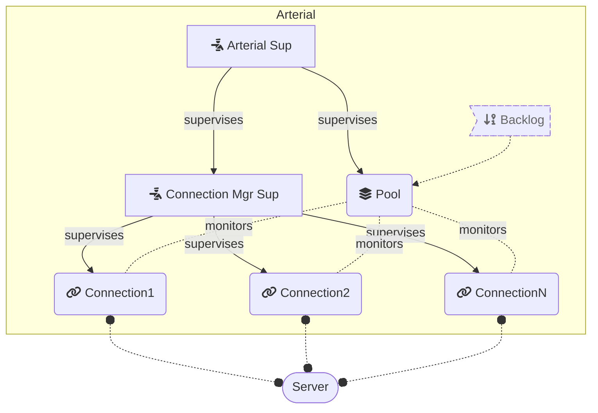

[](https://github.com/saleyn/arterial/actions/workflows/erlang.yaml)
[](https://hex.pm/packages/arterial)
[](https://hex.pm/packages/glazer)

`arterial` is a high-performance Erlang/Elixir connection-pooling library for
clients that talk to a server (or cluster of servers) over SSL/TCP/UDP.
The design is structurally a shared-nothing/lock-free concurrent model.
The pool, per-connection backlog tracking, and rate throttling are implemented
in a C++ NIF for performance; connection lifecycle, supervision, and socket
I/O stay on the Erlang side.

It's protocol-agnostic: you supply a module that knows how to encode
requests and decode responses for your wire protocol, and Arterial handles
checking out a connection, tracking in-flight requests, throttling,
reconnecting on failure, and timing out asynchronous requests that never
get a reply.

**Supported features:**

* Lock-free, atomic CAS–based connection pool (C++ NIF) with FIFO checkout
  order and ABA-safe versioned node indices.
* Per-connection request backlog, in either FIFO order (no wire-level
  request ID required) or random-access order (wire-level request ID,
  out-of-order replies supported), up to 65,536 in-flight requests per
  connection.
* Per-connection rate throttling (token-bucket style) checked on every
  checkout.
* A synchronous request API (`arterial_client:call/3`) where the caller
  owns the socket for the duration of one request/reply, and a
  send-and-forget API (`arterial_client:cast/2`) for protocols with no
  reply at all -- returns as soon as the request is handed to the
  transport, without ever holding a backlog slot in flight.
* An in-flight request registry (`UnorderedTTLMap`, owned by each
  pool's `ConnectionPool` instance) for the asynchronous path: register a
  request with `arterial_nif:track_inflight/5`, and if no matching
  `checkin_connection/4` happens before its TTL expires, the owning process
  receives `{arterial_timeout, Pool, ReqID}` and the request's backlog slot
  (and the connection itself) is automatically released back to the pool.
  TTLs can be either a single fixed duration per pool or set individually
  per request.
* An optional, lock-free, bounded queue-when-busy wait-list
  (`arterial_nif:checkout_async/3`): when every connection is busy, a
  caller can be queued (up to a fixed capacity set at pool creation)
  instead of failing immediately, and is serviced automatically as soon as
  a connection frees up, or timed out if it waits too long. Disabled by
  default (zero behavioral/cost impact unless explicitly enabled); see
  [Queue-when-busy checkouts](#queue-when-busy-checkouts).
* A per-pool `arterial_sweeper` process that periodically evicts expired
  in-flight requests and expired queued waiters by calling
  `arterial_nif:sweep_timeouts/1`.
* Automatic reconnect with exponential backoff per connection
  (`arterial_connection`).
* Disconnect notification for the asynchronous path: when a connection's
  socket dies, every process with a still-outstanding (`track_inflight/5`-
  registered) request on it receives `{arterial_disconnected, Pool, ReqID}`
  -- one message per request -- before the backlog slot is released, so it
  can resubmit or persist that request outside `arterial` instead of
  silently losing it. See `arterial_nif:connection_down/2`.

## Installation

Arterial is not yet published to Hex. Add it as a `rebar3` dependency directly
from its Git repository:

```erlang
{deps, [
  {arterial, {git, "https://github.com/saleyn/arterial.git", {branch, "main"}}}
]}.
```

## Architecture


```mermaid
flowchart TD
    subgraph arterial [Arterial]
    A[fa:fa-person-military-pointing Arterial Sup] --->|supervises| P(fa:fa-layer-group Pool)
    A[fa:fa-person-military-pointing Arterial Sup] --->|supervises| CS[fa:fa-person-military-pointing Connection Mgr Sup]
    B>fa:fa-arrow-down-9-1 Backlog] -.-> P
    style B stroke-width:1px,color:#666,stroke-dasharray: 5 5
    CS -->|supervises| C1(fa:fa-link Connection1)
    CS -->|supervises| C2(fa:fa-link Connection2)
    CS -->|supervises| CN(fa:fa-link ConnectionN)
    P -.-|monitors| C1
    P -.-|monitors| C2
    P -.-|monitors| CN
    end
    C1 o-.-o S([Server])
    C2 o-.-o S
    CN o-.-o S
```

`arterial_app` is a top-level `simple_one_for_one` supervisor that spawns one
`arterial_pool` supervisor per named pool. Each `arterial_pool` creates the
pool's C++-backed `ConnectionPool` NIF resource (which tracks which
connections are checked out/available, their per-connection request
backlog, throttles, and in-flight async request registry), then starts one
`arterial_connection` worker per connection slot plus one `arterial_sweeper`
that periodically evicts timed-out in-flight requests.

### Erlang layer

| Module | Responsibility |
|---|---|
| `arterial_app` | Application + top supervisor (`simple_one_for_one` of pools). |
| `arterial_pool` | Per-pool `supervisor`; creates the NIF pool resource, then starts one `arterial_connection` worker per connection slot and one `arterial_sweeper`. |
| `arterial_connection` | One `gen_server` per pooled connection. Owns the socket, runs the connect/reconnect state machine with exponential backoff, and drives the user-supplied client callback module (`arterial_client`). |
| `arterial_sweeper` | Per-pool timer process; calls `arterial_nif:sweep_timeouts/1` on an interval to evict expired in-flight async requests. |
| `arterial_socket` | Thin wrapper over Erlang's `socket` module for `tcp`/`udp` connect, plus `ssl` (requires OTP 28+ — see [SSL/TLS guide](docs/ssl-guide.md)). |
| `arterial_client` | Behaviour for the connection lifecycle/codec (`init/1`, `setup/2`, `handle_request/2`, `handle_data/2`, `handle_timeout/2`, `terminate/2`); also implements `call/3` (synchronous request API) and `cast/2` (send-and-forget API). |
| `arterial_protocol` | Behaviour for the wire transport and per-request codec (`connect/3`, `send/2`, `recv/2`, `encode_request/3`, `decode_reply/2`). |
| `arterial_proxy` | **Not yet working.** Originally intended as the asynchronous request/queuing path; largely superseded by `arterial_nif:checkout_async/3` (see [Implementation status](#implementation-status)) — whether this module still needs a rewrite is an open follow-up. |
| `arterial_nif` | Thin Erlang wrapper around the C++ NIF (pool create/destroy, checkout/checkin, checkout_async, availability, in-flight tracking, sweep). |
| `arterial_util` | Small helpers: random element selection, timeout/expiration arithmetic. |
| `arterial` | Shared public types (`client/0`, `socket/0`, `protocol/0`, etc). |

### C++ NIF layer (`c_src/`)

| File | Responsibility |
|---|---|
| `arterial.hpp` / `arterial.cpp` | `ConnectionPool`: wraps the lock-free FIFO pool of connections, the in-flight async request registry, and the optional queue-when-busy wait-list; NIF entry points (`create_nif`, `checkout_nif`, `checkin_nif`, `checkin_up_to_nif`, `checkout_async_nif`, `make_available_nif`/`make_unavailable_nif`, `connection_drained_nif`, `connection_down_nif`, `track_inflight_nif`, `sweep_timeouts_nif`). |
| `connection.hpp` | `Connection`: one pooled connection's id, socket term, request backlog, and vector of throttles. |
| `backlog.hpp` | Per-connection in-flight request tracking — see [Backlog modes](#backlog-modes). |
| `pool_fifo.hpp` / `pool_lifo.hpp` | Lock-free, atomic CAS–based object pools (FIFO built on top of a LIFO base) used to hand out `Connection*` objects with `CheckOut`/`CheckIn`/`MakeAvailable`/`MakeUnavailable` semantics and ABA-safe versioned node indices. |
| `wait_list.hpp` | `WaitList`: a bounded, lock-free MPMC ring buffer (Vyukov-style) of queued `checkout_async` callers, used by the optional queue-when-busy feature — see [Queue-when-busy checkouts](#queue-when-busy-checkouts). |
| `throttle.hpp` | `basic_time_spacing_throttle<T>` — a token-bucket-style rate limiter (ported from [utxx's `rate_throttler`](https://github.com/saleyn/utxx/blob/master/include/utxx/rate_throttler.hpp)) that checks elapsed time on each call instead of running a timer thread. |
| `unordered_ttl_map.hpp` | Hash map + sorted LRU eviction list, used to track in-flight asynchronous requests and their deadlines (either one fixed TTL per pool, or a per-request deadline kept sorted on insert); also used to track deadlines for queued waiters. |
| `enif.hpp` | Generic C++/Erlang NIF interop helpers (term conversion, resource wrapping). |
| `test_pool.cpp` | Standalone tests for the FIFO/LIFO object pools. |

### Connection checkout

`ConnectionPool::CheckOut` (`c_src/arterial.hpp`) walks the FIFO pool of
connections; for each candidate it checks whether all of the connection's
throttles currently have room for the requested number of samples, and
whether its backlog has free request slots. If both checks pass, the slot(s)
are reserved and the connection is returned to the caller; otherwise the
connection is checked back in at the tail of the pool and the next one is
tried, up to one full pass over the pool.

### Backlog modes

A connection's backlog tracks requests that have been sent but not yet
answered. Two implementations exist, chosen per the wire protocol's
capabilities (`backlog.hpp`):

* **`FIFOBackLog`** — for protocols whose messages carry no request ID.
  Replies are assumed to arrive in the same order requests were sent;
  checkout/checkin happens at the head/tail of a circular buffer.
* **`RandomAccessBackLog`** — for protocols that embed a request ID in each
  message, so replies can come back out of order. Slots are tracked in a
  `std::set` of free indices and looked up by decoded request ID on checkin.

Both are bounded by a 16-bit internal index (`BaseReqID`), so a connection
supports **at most 65,536 in-flight requests**.

### Asynchronous in-flight timeouts

Each `ConnectionPool` owns an `UnorderedTTLMap<ReqID, {pid,
Connection*}>` registry, separate from the per-connection backlog, keyed by
the request's wire-level `ext_req_id`:

1. After checking out a connection for an asynchronous request, call
   `arterial_nif:track_inflight(Pool, ConnID, ReqID, self(), TtlUs)` to
   register it. `TtlUs` is ignored if the pool was created with a fixed
   timeout (`create/6`'s last argument); otherwise each request keeps its
   own deadline, and the registry's eviction list stays sorted by deadline
   regardless of insertion order.
2. If a reply arrives, call `checkin_connection/4` as usual — this also
   untracks the request from the registry.
3. If nothing calls `checkin_connection/4` before the deadline, the next
   `arterial_nif:sweep_timeouts/1` call (run periodically by
   `arterial_sweeper`) sends `{arterial_timeout, Pool, ReqID}` to the owning
   process **and** releases the request's backlog slot and returns the
   connection to the pool — equivalent to what `checkin_connection/4` would
   have done, just triggered by the timeout instead of an explicit checkin.

### Queue-when-busy checkouts

By default, checking out a connection when every connection in the pool is
busy (throttled or backlog-full) fails immediately with
`{error, no_connection}` — this is unchanged and is what both
`checkout_connection/2` and `checkout_async/3` do when the feature described
here is not enabled.

`arterial_nif:checkout_async/3` adds an **optional** alternative: instead of
failing immediately, the caller can be queued and serviced automatically as
soon as capacity frees up. The feature is opt-in per pool, controlled by
`create/7`'s `MaxWaiters` argument (`0`, the default via `create/5` and
`create/6`, disables it entirely at effectively zero cost — a disabled
`WaitList` never allocates more than a single dummy ring slot and every
`checkout_async/3` call behaves exactly like `checkout_connection/2`).

The wait-list itself (`c_src/wait_list.hpp`) is a fixed-capacity, lock-free
MPMC ring buffer (Vyukov-style) of queued callers — bounded so it can never
grow without limit, and built independently of `pool_fifo.hpp` because that
structure is unsafe under repeated claim/release cycling (see the comment at
the top of `wait_list.hpp` for why).

`checkout_async(Pool, Pid, TtlUs)` has three possible outcomes:

1. **A connection is available immediately** — returns `{ok, Map}`, exactly
   like `checkout_connection/2`. No message follows.
2. **Every connection is busy, but the wait-list has room** — the request is
   queued and `{queued, WaiterID}` is returned immediately. `Pid` will later
   receive exactly one of:
   * `{arterial_ready, Pool, ReqID, ConnID, Socket, ReqIDs}` once a
     connection is assigned — call `checkin_connection/4` with the real
     wire-level `ReqID`/`ReqIDs` from this message when done, exactly as for
     a synchronous checkout.
   * `{arterial_timeout, Pool, WaiterID}` if `TtlUs` microseconds pass while
     still queued, without ever being assigned a connection.
3. **Every connection is busy and the wait-list is disabled or full** —
   returns `{error, no_connection}`, same as `checkout_connection/2`.

`TtlUs` bounds the *entire* call, from the moment `checkout_async/3` is
invoked until a reply is checked in — covering both time spent queued and
time spent in-flight once a connection is assigned. It's ignored (like
`track_inflight/5`'s `TtlUs`) if the pool uses a fixed per-pool timeout.

Queued waiters are serviced from two places, both of which drain the
wait-list in FIFO order (oldest queued caller first):

* `checkin_connection/2,4` — after releasing a connection back to the pool,
  it immediately tries to service the head of the wait-list with that
  connection before the connection is offered to any new, non-queued
  checkout.
* `sweep_timeouts/1` — besides evicting expired in-flight requests (see
  above), it also evicts expired queued waiters (sending them
  `{arterial_timeout, Pool, WaiterID}`), and any connection capacity freed
  up by evicting a *different*, timed-out in-flight request is immediately
  offered to the head of the wait-list.

## Protocol

It is the responsibility of the user to provide a module for encoding and decoding messages over the selected socket transport. Which configuration to use depends entirely on what the wire protocol's messages look like. There are 6 supported modes:

1. **Native request ID.** Each wire-level message contains a 32-bit (or 64-bit) request ID, and replies are not required to arrive in FIFO order. Use `RandomAccessBackLog` (`fifo => false`), any `backlog` value below 65,536 (the 16-bit internal index cap — see [Backlog modes](#backlog-modes)). Requests can be sent asynchronously, with up to 64k in-flight per connection.

2. **Surrogate request ID.** Same as above, but for protocols that don't define a "request ID" concept of their own and instead expose *some* extensible/free-form field your `encode_request/3` can repurpose as one (a correlation tag, an unused header word, an opaque client cookie the server is required to echo back unmodified). `arterial` doesn't care whether the ID is one the protocol natively defines or one you synthesize and inject yourself — `RandomAccessBackLog` matches replies purely by the bits in `ext_req_id`, with no notion of which side "owns" the ID's meaning. Same `fifo => false` configuration as mode 1; see [client-guide.md's "Surrogate request IDs"](docs/client-guide.md#surrogate-request-ids) for a worked example.

3. **FIFO, backlog = 1 (synchronous reservation).** Wire-level messages don't encode a request ID (and no field can be repurposed as one), so replies are matched purely by FIFO send order. A client reserves the connection for the lifetime of one request and awaits the response synchronously — no concurrent in-flight requests, so no backlog capacity is needed beyond the default of 1.

4. **FIFO, backlog > 1 (asynchronous multiplexing).** Same FIFO-order matching as mode 3, but with `backlog > 1, fifo => true` so several requests can be outstanding on one connection at once. **This depends on a guarantee `arterial` cannot verify**: the server must actually preserve send order in its replies. `FIFOBackLog::CheckIn` always releases the oldest outstanding slot — it has no way to detect a server that violates this (e.g. by replying out of order once), and a single violation silently misattributes every reply after it with no error raised anywhere. Prefer mode 1 or 2 whenever the protocol allows it; reserve this mode for protocols that truly have no ID-capable field, and consider pairing it with a short `fixed_timeout_us` so a confused backlog at least self-heals via the sweeper instead of wedging indefinitely.

   To actually multiplex several outstanding requests on **one** connection, reserve them all in a single call: `arterial_nif:checkout_connection/3` and `arterial_nif:checkout_async/4` take a `Samples` argument that reserves that many backlog slots on one connection at once, returning that many `req_ids`. This is required, not just convenient: a connection is removed from the pool's available set on its first successful checkout and isn't returned until something checks it back in, so repeated single-sample (`Samples = 1`, the `/2`/`/3`-arity default) checkouts against an idle connection never land on the same connection twice in a row — they get a different connection or, if none are free, queue/fail. See `arterial_nif:checkout_connection/3`'s and `checkout_async/4`'s docs for the full contract, and `test/arterial_nif_tests.erl`'s `fifo_backlog_multiplexing_test/0`/`fifo_backlog_multiplexing_async_test/0` for worked examples.

5. **Send-and-forget (no reply at all).** Use `arterial_client:cast/2` instead of `call/3` — it hands the request to `send/2` and returns as soon as the bytes are accepted by the transport, never blocking on (or even allocating a backlog slot for) a reply. Since nothing is ever in-flight, none of the backlog-mode tradeoffs above apply: `backlog`/`fifo` settings don't matter for a connection's `cast/2` traffic, and there's no `req_ids` for the caller to hold or check in later. Typical use: fire-and-forget logging/metrics.

6. **Acknowledgement-based protocols**, two variants:

   * **Per-message ack**: the server's "reply" to a request is just an ack (carrying the id back, or not even that, as long as your framing can tell which message it closes out) rather than a real response payload. This needs nothing extra — it's the *same* matching as mode 1 or 2 (`fifo => false`); `decode_reply/2` simply returns whatever small ack term applies (even just the atom `ack`) once it recognizes the match. See [client-guide.md's "Per-message acks"](docs/client-guide.md#per-message-acks) for a worked example.
   * **Bulk/cumulative ack**: a single ack confirms several previous requests at once (e.g. a heartbeat carrying "processed through sequence N"). This is a genuinely different mechanism, using `arterial_nif:checkin_up_to/3`: it releases every outstanding FIFO slot up to and including a given `req_id` in one call, even across requests originally reserved by different callers. Only meaningful with `fifo => true` (mode 3 or 4); a no-op against a random-access backlog (mode 1/2). See [client-guide.md's "Bulk/cumulative acks"](docs/client-guide.md#bulkcumulative-acks) for the full contract and `test/arterial_nif_tests.erl`'s `checkin_up_to_releases_fifo_span_test/0` for a worked example.

**Disconnect notification** applies across modes 1–4 and 6 (anywhere a request can be genuinely in-flight): if a connection's socket dies while it still has unconfirmed asynchronous (`track_inflight/5`-registered) requests, each owning process receives `{arterial_disconnected, Pool, ReqID}` so it can resubmit or persist that request outside `arterial`. See `arterial_nif:connection_down/2`, called automatically from `arterial_connection`'s disconnect path. Not applicable to mode 5 (nothing is ever in-flight to lose).

### Behaviours to implement

Two behaviours decouple the wire transport from request/response encoding:

* **`arterial_protocol`** ([src/arterial_protocol.erl](src/arterial_protocol.erl)) — the transport and per-request codec: `connect/3`, `close/1`, `send/2`, `recv/2`, `setopts/2`, `encode_request/3`, `decode_reply/2`.
* **`arterial_client`** ([src/arterial_client.erl](src/arterial_client.erl)) — the connection lifecycle: `init/1`, `setup/2`, `handle_request/2`, `handle_data/2`, `handle_timeout/2` (optional), `terminate/2`. Also implements `call/3`, the synchronous request API, and `cast/2`, the send-and-forget API (see [Protocol](#protocol) mode 5) — both used by callers directly; the caller's own process owns the socket for the call's duration via `arterial_protocol`, and `arterial_connection`'s `gen_server` is not involved in either call itself.

Pool/connection options (`t:arterial_client:options/0`) include `address`/`ip`
(or `addresses`, for failover across several), `port`, `protocol` (`tcp` |
`udp` | `ssl` — see [docs/ssl-guide.md](docs/ssl-guide.md) for `ssl`, which
needs OTP 28+), `reconnect`, `reconnect_time`, `bounce_interval_ms`,
`socket_options`, and `tls_options` (only used when `protocol => ssl`).
`t:arterial_pool:options/0` (passed to `arterial_pool:start_link/2`)
additionally controls `size`, `backlog`, `fifo`, `fixed_timeout_us`,
`sweep_interval_ms`, `protocol` (here, the wire codec module — not the
same `protocol` key as above), `client`, and `client_opts` (the
per-connection options map above).

For a full step-by-step walkthrough of implementing both behaviours,
wiring them into a pool, and testing against a real server, see
[Arterial Client Implementation Guide](docs/clent-guide.md). For the `ssl` transport
specifically (OTP 28+ required), see [SSL Guide](docs/ssl-guide.md).

## Observability

Arterial emits events for `call`/`cast`/`checkout`/`connect` (each as a
`start`/`stop`/`exception` span), plus one-shot `disconnect` and `sweep`
events, through a pluggable facade,
[src/arterial_observability.erl](src/arterial_observability.erl) — see
its moduledoc for the full event/measurement/metadata catalog.

The backend that actually receives these events is chosen via the
`arterial` application's `observability` env var:

```erlang
{arterial, [{observability, telemetry}]}    % default; forwards to telemetry:execute/3
{arterial, [{observability, prometheus}]}   % records straight into Prometheus metrics
{arterial, [{observability, my_module}]}    % your own arterial_observability callback module
```

Both `telemetry` and `prometheus` are strictly optional dependencies
(declared in `rebar.config` but absent from `arterial.app.src`'s
`applications`) — only the configured backend's dependency is ever
started, the same lazy pattern `arterial_socket` uses for `ssl`. With the
`prometheus` backend, call `arterial_observability_prometheus:start/0,1`
once at boot to declare its metrics, then wire up your own exporter
(`prometheus_httpd`, `prometheus_cowboy2`, etc.) separately. Writing your
own backend means implementing a single `arterial_observability`
callback, `event/3`.

## Documentation

This README is the primary documentation; module-level `@doc`/`-spec`
comments cover the public API of each module listed above. Arterial is not
yet published to Hex, so there are no hosted hexdocs.

## License

Arterial uses [MIT License](LICENSE). You can use the source code freely
in any project, including commercial applications, as long as you give
credit by publishing the contents of the LICENSE file somewhere in your
documentation.